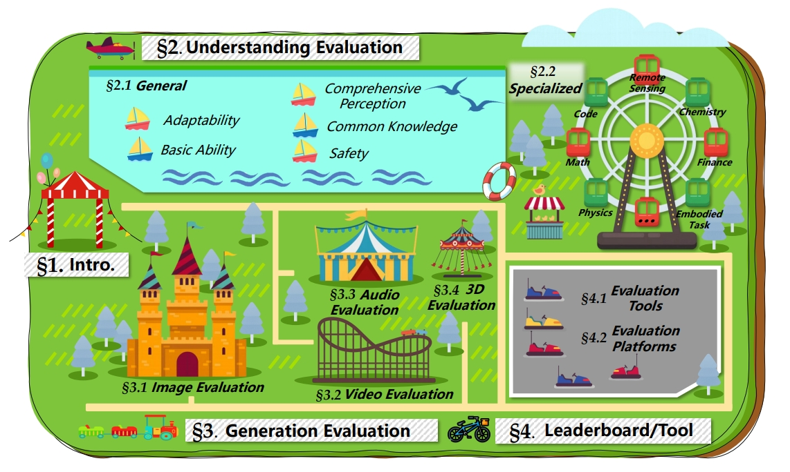

# Large Multimodal Models Evaluation: A Survey

This repository complements the paper *Large Multimodal Models Evaluation: A Survey* and organizes benchmarks and resources across understanding (general and specialized), generation, and community platforms. It serves as a hub for researchers to find key datasets, papers, and code.

**Paper:** [arXiv Preprint](https://arxiv.org/)
**Project Page:** [AIBench / LMM Evaluation Survey](https://github.com/aiben-ch/LMM-Evaluation-Survey)

---

## Table of Contents

1. [Understanding Evaluation](#understanding-evaluation)

   * [General](#general)

     * [Adaptability](#adaptability)
     * [Basic Ability](#basic-ability)
     * [Comprehensive Perception](#comprehensive-perception)
     * [General Knowledge](#general-knowledge)
     * [Safety](#safety)
   * [Specialized](#specialized)

     * [Math](#math)
     * [Physics](#physics)
     * [Chemistry](#chemistry)
     * [Finance](#finance)
     * [Healthcare & Medical Science](#healthcare--medical-science)
     * [Code](#code)
     * [Earth Science / Remote Sensing](#earth-science--remote-sensing)
     * [Embodied Tasks](#embodied-tasks)
2. [Generation Evaluation](#generation-evaluation)

   * [Image](#image)
   * [Video](#video)
   * [Audio](#audio)
   * [3D](#3d)
3. [Leaderboards and Tools](#leaderboards-and-tools)

---

## Understanding Evaluation

### General

#### Adaptability

| Benchmark   | Paper                                     | Project Page                                         |
| ----------- | ----------------------------------------- | ---------------------------------------------- |
| LLaVA-Bench | [Visual instruction tuning](https://arxiv.org/abs/2304.08485) | [GitHub](https://github.com/haotian-liu/LLaVA) |
| MIA-Bench   | [Mia-bench: Towards better instruction following evaluation of multimodal llms](https://arxiv.org/abs/2407.01509) | [Github](https://github.com/apple/ml-mia-bench) |
| MM-IFEval   | [MM-IFEngine: Towards Multimodal Instruction Following](https://arxiv.org/abs/2504.07957) | [Github]([https://github.com/apple/ml-mia-bench](https://github.com/SYuan03/MM-IFEngine))  |

#### Basic Ability

| Benchmark              | Paper                       | Project Page                                            |
| ---------------------- | --------------------------- | ------------------------------------------------- |

#### Comprehensive Perception

| Benchmark         | Paper                       | Project Page                                            |
| ----------------- | --------------------------- | ------------------------------------------------- |

#### General Knowledge

| Benchmark | Paper                       | Project Page |
| --------- | --------------------------- | ------ |

#### Safety

| Benchmark      | Paper                       | Project Page |
| -------------- | --------------------------- | ------ |

### Specialized

#### Math

| Benchmark      | Paper                       | Project Page |
| -------------- | --------------------------- | ------ |

#### Physics

| Benchmark    | Paper                       | Project Page |
| ------------ | --------------------------- | ------ |

#### Chemistry

| Benchmark | Paper                       | Project Page |
| --------- | --------------------------- | ------ |

#### Finance

| Benchmark    | Paper                       | Project Page |
| ------------ | --------------------------- | ------ |

#### Healthcare & Medical Science

| Benchmark      | Paper                       | Project Page |
| -------------- | --------------------------- | ------ |

#### Code

| Benchmark   | Paper                       | Project Page |
| ----------- | --------------------------- | ------ |

#### Earth Science / Remote Sensing

| Benchmark  | Paper                       | Project Page |
| ---------- | --------------------------- | ------ |

#### Embodied Tasks

| Benchmark     | Paper                       | Project Page |
| ------------- | --------------------------- | ------ |

---

## Generation Evaluation

### Image

| Benchmark   | Paper                       | Project Page |
| ----------- | --------------------------- | ------ |

### Video

| Benchmark | Paper                       | Project Page |
| --------- | --------------------------- | ------ |

### Audio

| Benchmark  | Paper                       | Project Page |
| ---------- | --------------------------- | ------ |

### 3D

| Benchmark     | Paper                       | Project Page |
| ------------- | --------------------------- | ------ |

---

## Leaderboards and Tools

| Platform      | Link                                                    |
| ------------- | ------------------------------------------------------- |
| LMMs-Eval     | [GitHub](https://github.com/EvolvingLMMs-Lab/lmms-eval) |
| Chatbot Arena | [Website](https://lmsys.org/arena/)                     |
| OpenCompass   | [GitHub](https://github.com/open-compass/opencompass)   |

---
## Contributions

We welcome pull requests (PRs)! If you contribute five or more valid benchmarks with relevant details, your contribution will be acknowledged in the next update of the paper's Acknowledgment section.
